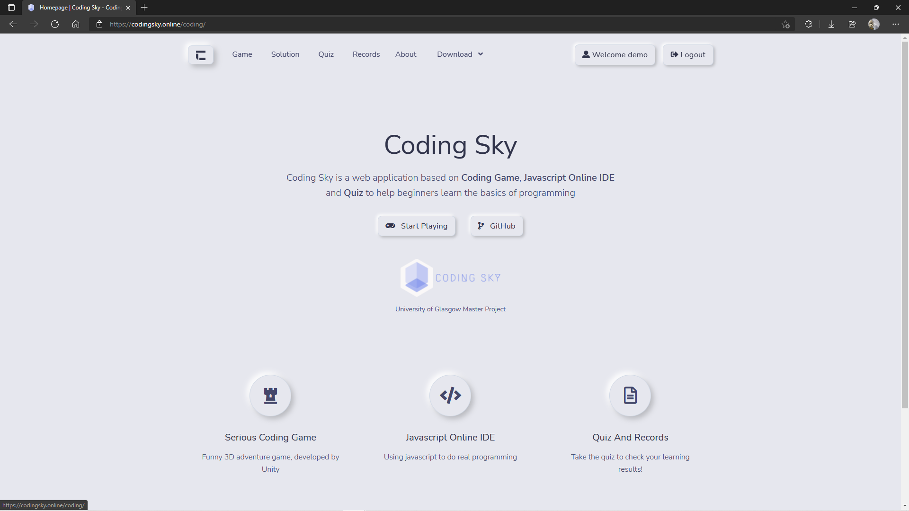

# Coding Sky

University of Glasgow IT+ Project Web App - Coding Sky

COMPSCI5018P MSc Development Project for IT+ (2020/21)

[Unity Game Repo](https://github.com/Siriusq/CodingSky)

## Introduction
The project mainly consists of a programming game developed using Unity, a quiz application developed using Django, and a JavaScript online editor based on the Ace editor.

## Instructions to run
**Clone And Open Project**

    $ git clone git@github.com:Siriusq/coding_sky.git
    $ cd .\coding_sky\

**Create Virtual Environment**

    $ conda create -n coding_sky python=3.7.5 

**Activate Virtual Environment**

    $ conda activate coding_sky

**Install Required Packages**

    $ pip install -r requirements.txt

**Build Database**

    $ python manage.py makemigrations
    $ python manage.py migrate --run-syncdb

**Create Superuser**

    $ python manage.py createsuperuser

**Start The Server**

If used for production

    $ python manage.py runserver --insecure

If used for development
- Open '.\coding_sky\coding_sky\settings.py'
- Change 'DEBUG = False' To 'DEBUG = True'

        $ python manage.py runserver

## Test

    $ python manage.py test coding.tests

## Browser Compatibility
Since the game uses WebGL 2.0, according to the [Unity Official Documentation](https://docs.unity3d.com/2021.1/Documentation/Manual/webgl-browsercompatibility.html), the compatible browsers are as follows.

- Mozilla Firefox 51 and newer
- Google Chrome 56 and newer
- Microsoft Edge (based on Chromium)
- Apple Safari 15 and newer

## Reference
The quiz function and running Javascript code in the browser function refer to the following source code.

> [1]	S. Shindemeshram (2019), django-quiz-app: It is django based quiz app for multiple choice questions. [Source code]. Available: https://github.com/sswapnil2/django-quiz-app.

> [2]	L.-V. Le (2020), code-editor-tutorial. [Source code]. Available: https://github.com/luvuong-le/code-editor-tutorial.

